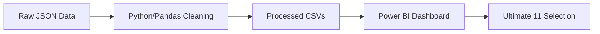
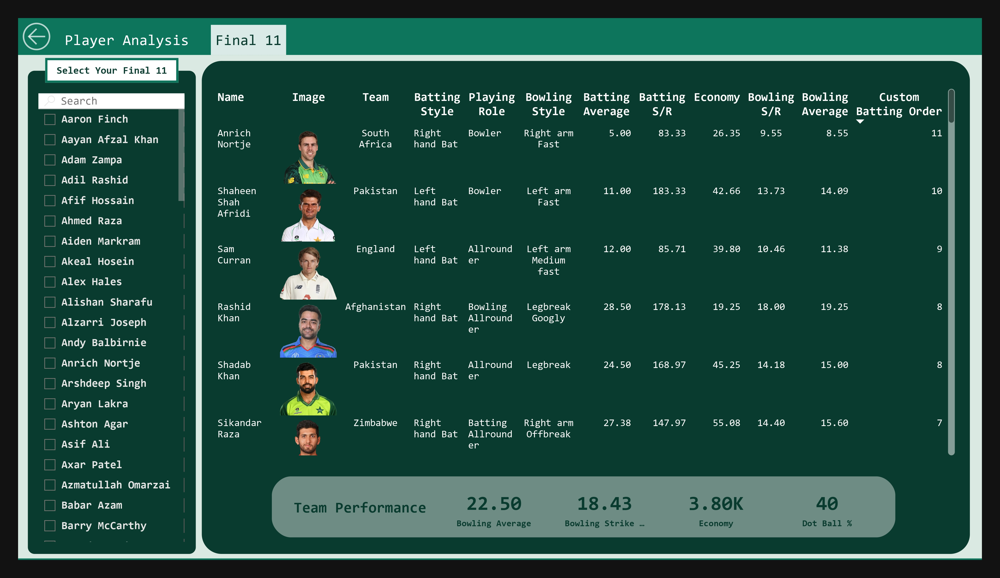
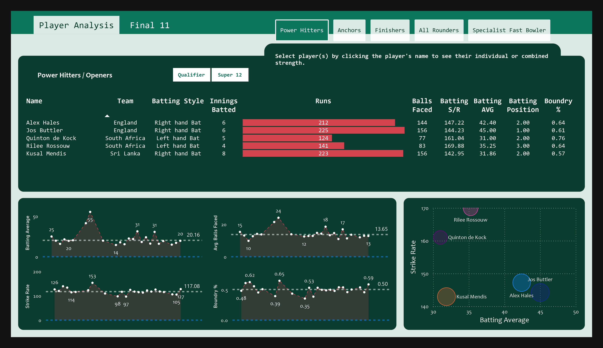
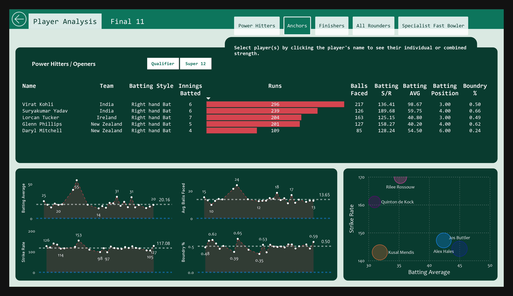
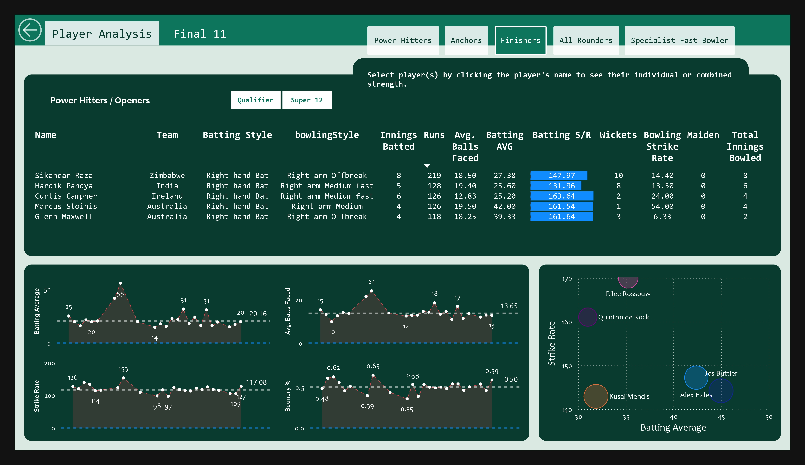
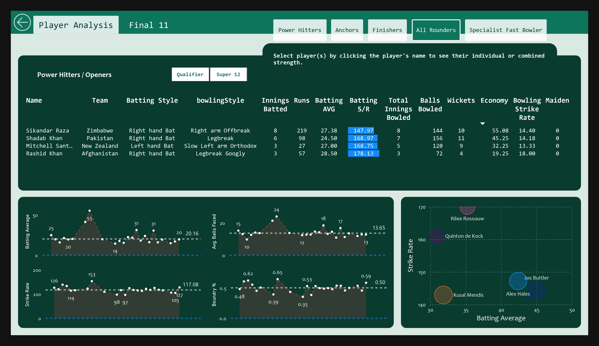

# 🏏 Cricket Data Analysis: Building the Ultimate Dream Team 🏆


A comprehensive data analytics project that leverages historical T20 World Cup data to identify the "Ultimate 11" cricketers. By defining rigorous performance metrics across different player roles, this project transforms raw match data into actionable insights and a professional-grade visualization dashboard.

## Key Features

- **Automated Data Cleaning**: Robust Python scripts to process nested JSON data from match summaries, batting/bowling statistics, and player profiles.
- **Role-Based Filtering**: Advanced selection logic for Openers, Middle Order, Finishers, All-Rounders, and Specialist Fast Bowlers.
- **Interactive Visualization**: A feature-rich Power BI dashboard allowing for dynamic player comparison and squad selection.
- **Criteria-Driven Analysis**: Data-backed decisions based on Strike Rate, Batting Average, Boundary %, Economy, and more.

---

## 🛠️ Tech Stack

- **Language**: Python 3.10+
- **Data Manipulation**: Pandas
- **Visualization**: Power BI Desktop
- **Data Format**: JSON (Raw), CSV (Processed)
- **Documentation**: Markdown

---

## 📋 Prerequisites

Before you begin, ensure you have the following installed:

- **Python 3.x**: [Download Python](https://www.python.org/downloads/)
- **Jupyter Notebook/Lab**: Or VS Code with the Jupyter extension.
- **Power BI Desktop**: Required to view and interact with the `.pbix` visualization. [Download Power BI](https://powerbi.microsoft.com/desktop/)
- **Pandas Library**: Install via pip:
  ```bash
  pip install pandas
  ```

---

## 🚀 Getting Started

### 1. Clone the Repository
```bash
git clone https://github.com/VijayAdithyaBK/Cricket_Data_Analysis.git
cd Cricket_Data_Analysis
```

### 2. Prepare the Data
The raw data is located in `data/cricket_data_analytics_json_files/`. To process this into clean CSVs:
1. Open the Jupyter Notebook: `code/cricket_data_analytics_data_processing.ipynb`.
2. Run all cells. This will read the JSON files, perform cleaning/renaming, and export the processed CSVs to `data/cricket_data_analytics_csv_files/`.

### 3. Explore the Visualization
1. Launch Power BI Desktop.
2. Open `code/cricket_data_analytics_data_visualization.pbix`.
3. If prompted, refresh the data source to point to the newly generated CSVs in your local directory.

---

## 🏗️ Architecture

### Data Flow


### Directory Structure
```
Cricket_Data_Analysis/
├── 📁 assets/               # Visual assets, banners, and final reports
│   ├── 🖼️ banner.png       # Project banner
│   ├── 🖼️ final_11.jpg     # Screenshot of the dream team
│   └── 📄 cricket_data_analytics.pdf # Static report
├── 📁 code/                 # Analysis scripts and files
│   ├── 📓 data_processing.ipynb   # Python cleaning logic
│   └── 📊 data_visualization.pbix # Power BI dashboard
├── 📁 data/                 # Data storage
│   ├── 📁 csv_files/        # Cleaned data for Power BI
│   └── 📁 json_files/       # Raw match and player data
├── 📄 ANALYSIS_CRITERIA.md   # Detailed selection formulas
└── 📄 README.md             # Project documentation
```

### Key Components

**1. Data Processing (`code/data_processing.ipynb`)**
- Handles complex nested JSON structures.
- Maps match IDs across different data tables (Match Results ↔ Batting ↔ Bowling).
- Fixes naming inconsistencies and handles null values.

**2. Selection Logic (`ANALYSIS_CRITERIA.md`)**
- **Openers**: High Strike Rate (>140) and solid average (>30).
- **Specialist Bowlers**: Focus on Economy (<7) and Strike Rate (<16).
- **All-Rounders**: Balanced criteria across both disciplines.

---

## 📊 Data Dictionary

### Raw JSON Schemas
- **Match Results**: `team1`, `team2`, `winner`, `margin`, `ground`, `matchDate`, `scorecard`.
- **Batting Summary**: `match`, `teamInnings`, `battingPos`, `batsmanName`, `runs`, `balls`, `4s`, `6s`, `SR`.
- **Bowling Summary**: `match`, `bowlingTeam`, `bowlerName`, `overs`, `maiden`, `runs`, `wickets`, `economy`, `0s`, `4s`, `6s`, `wides`, `noBalls`.

### Processed CSVs
- `dim_players.csv`: Unique player profiles and metadata.
- `fact_batting_summary.csv`: Cleaned batting performances linked by `match_id`.
- `fact_bowling_summary.csv`: Cleaned bowling spells linked by `match_id`.

---

## 🏆 Analysis Results

The final selection represents the pinnacle of performance based on the T20 World Cup data.



### Highlights by Role
| Role | Top Performers |
| :--- | :--- |
| **Power Hitters** |  |
| **Anchors** |  |
| **Finishers** |  |
| **All-Rounders** |  |

---

## 🛠️ Troubleshooting

### Common Issues

**1. Path Errors in Jupyter Notebook**
- **Symptom**: `FileNotFoundError` when reading JSONs.
- **Solution**: Ensure you are running the notebook from the `code/` directory or update the relative paths in the first cell to point to `../data/`.

**2. Data Source Errors in Power BI**
- **Symptom**: "Could not find file" error upon opening the PBIX.
- **Solution**: Go to `Transform Data` > `Data Source Settings` and update the file path for each CSV to match your local repository location.

**3. Null Values in CSVs**
- **Symptom**: Players missing from the dashboard.
- **Solution**: Check the filtering criteria in `ANALYSIS_CRITERIA.md`. If a player doesn't meet the "Innings Played" threshold, they are intentionally excluded.

---

## 🤝 Contributing

Contributions are welcome! If you'd like to improve the analysis or add new data:
1. Fork the repository.
2. Create a new branch (`git checkout -b feature/improvement`).
3. Commit your changes.
4. Push to the branch.
5. Open a Pull Request.

---

<div align="center">

### ⚡ Crafted by [Vijay Adithya B K](https://github.com/VijayAdithyaBK)

</div>
